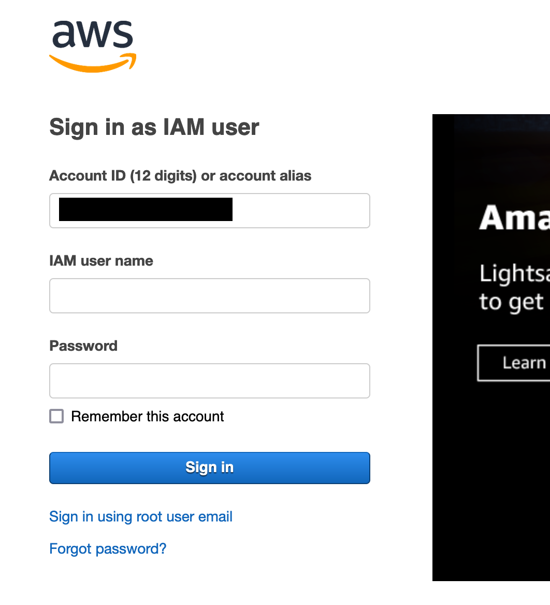
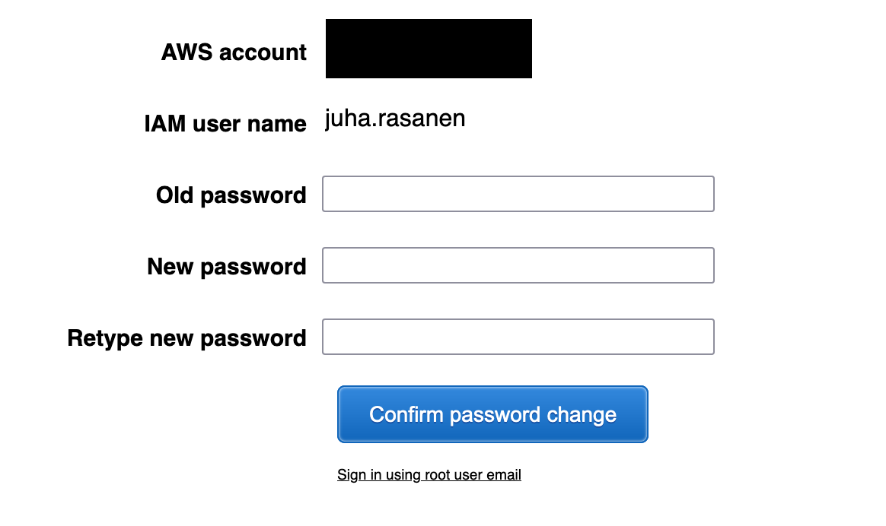
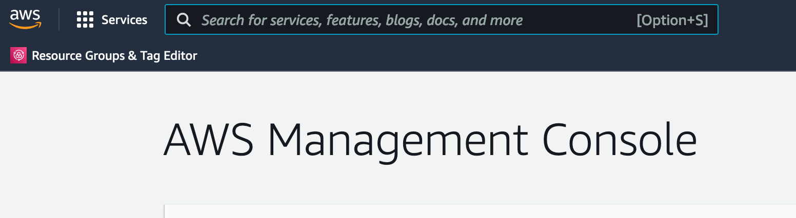
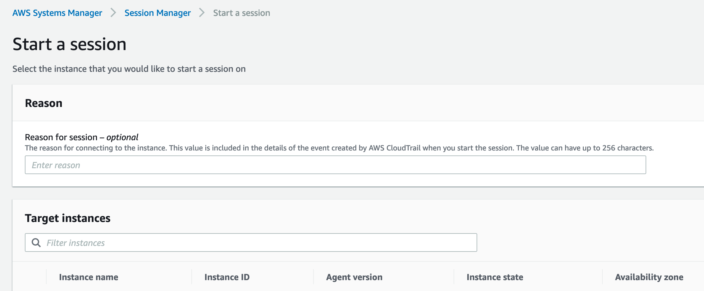

# Kubernetes security exercise Lab

## Note about the training environment

You are allowed to play around inside the cluster as you wish, but you
are not allowed to gain access to other resources inside the account. If you
do manage to do that, please let us know. The idea is to play around with
Kubernetes, not to simulate a real attack.

## Prerequisite: signing in to Fraktal's training account for shell access

You will get an email to sign in to the AWS environment. It contains a link
which will take you to the login page. Enter the username (firstname.lastname)
and the password you received from Fraktal:



Next, you'll be required to change your password. Make yourself a new password
and store it safely for future usage:



Now you should have arrived at the AWS Console home page:



Copy-paste or click the link to [Session
manager](https://eu-north-1.console.aws.amazon.com/systems-manager/session-manager/start-session?region=eu-north-1)
which should lead to you page that looks like this:



Note if you go to Session Manager through the AWS Console navigation, make
sure that you are in the eu-north-1 region. The above link contains the region
with it.

Select k8s-seclab-bastion from the list and click Start session. Although the
page lists all the virtual machines, you can only start a session in the
bastion host.

There's a personal cluster for every participant in the environment. You can
access it by setting the environment variable KUBECONFIG:

    export KUBECONFIG="/tmp/config-<your.username>"

Now running:

    kubectl get nodes

should now produce an output like this:

    ip-X-Y-Z-A.eu-north-1.compute.internal   Ready    control-plane,master   9d    v1.22.5+k3s1

where the actual IP address is different for every participant.

**If you get this far, you've finished the first task.**

## Task: Inspecting Pod security settings

As discussed, easiest way to inspect Pod specifications' security posture is
to use kubesec.io, which can be run from the command line when you have Docker
installed. (Note: run docker on your own workstation.)

Create a file named minimal.yaml on your machine with these contents:

    apiVersion: v1
    kind: Pod
    metadata:
      name: kubesec-demo
    spec:
      containers:
        - name: kubesec-demo
          image: gcr.io/google-samples/node-hello:1.0

Then issue the command:

    docker run -i kubesec/kubesec:2.11.1 scan - < minimal.yaml

It should give the score of 0 and have a long list of items in the "advise"
section. **Read through the recommendations**.

**Deploy the Pod to your cluster**:

    kubectl apply -f minimal.yaml

You can see the hello world application in action by running:

    kubectl port-forward kubesec-demo 8080:8080

And going to http://localhost:8080 with your browser or curl.

Question: **as what user is the process run inside the Pod currently?**

Hint: you can go inside the pod by issuing the command:

    kubectl exec -it kubesec-demo -- bash

and then run normal unix commands.

**Change the Pod definition so that the server process is no longer run as
root and redeploy the Pod**.

You must first delete the existing Pod and then running the apply again:

    kubectl delete -f minimal.yaml
    kubectl apply -f minimal.yaml

Run the kubesec scan again and observe the change in the score.

**Modify the the Pod definition in following ways (one at a time) and take note
of the changes in scoring**. Deploy the application again so that you can
verify that the changes actually work.

* Make the root filesystem read-only
* Limit the amount of memory that the Pod can use to 100 megabytes
  * **What can you say about the request size if you only give the limit?**
  * Hint: you can use kubectl describe pod <pod-name> to observe the limits and
  * Add explicit memory request to 50 megabytes requests
* Make the container privileged.
  * Start a shell inside a privileged container and a non-privileged container
  * Observe the differences in the /dev filesystem
* Make the container to allow privilege escalation

Now you've successfully finished the task: **Inspecting Pod security
settings**

## Task: Role-based access control

Familiarize yourself with the RBAC concepts with a Pod that runs a kubectl
inside it. The kubectl binary uses the service account token mounted at
/var/run/secrets/kubernetes.io/serviceaccount/token.

This usage of the service account and kubectl inside a container is only for
demonstration purposes and usually it is not recommended to run kubectl inside
the containers and authorize the service account to do administrative tasks.
For the lab environment, however, it is the most straight-forward way to work
with Kubernetes identities.

Create a Pod definition listed below in a file named kubectl-pod.yaml:

    apiVersion: v1
    kind: Pod
    metadata:
      name: kubectl
    spec:
      containers:
        - name: kubectl
          image: bitnami/kubectl
          command:
            - sleep
            - "infinity"

Then create the Pod by running kubectl on your own workstation like this:

    kubectl apply -f kubectl-pod.yaml

You should see the Pod with the command get pods:

    kubectl get pods
    NAME      READY   STATUS    RESTARTS   AGE
    kubectl   1/1     Running   0          2m33s

Start a shell inside the Pod with the command:

    kubectl exec -it kubectl -- bash

(This starts a bash shell inside the Pod named kubectl, ie. it runs inside
your cluster. The kubectl inside the container uses the service account
assigned to the Pod to authenticate to the cluster.)

Running kubectl inside the container produces an error:

    I have no name!@kubectl:/$ kubectl get pods
    Error from server (Forbidden): pods is forbidden: User "system:serviceaccount:default:default" cannot list resource "pods" in API group "" in the namespace "default"

This is because the kubectl inside the container is using the default service
account and it hasn't been given any permissions. The kubectl you're running
from your own workstation has full administrative authority.

Note: you shouldn't be giving special permissions to the default service
account for this exact reason. If the attacker gains access to a container,
you don't want to give them any other access to your cluster.

But to demonstrate RBAC concepts, let's first give our Pod our own service
account. Modify the kubectl-pod.yaml file to be the following:

    apiVersion: v1
    kind: ServiceAccount
    metadata:
      name: my-service-account
    ---
    apiVersion: v1
    kind: Pod
    metadata:
      name: kubectl
    spec:
      serviceAccountName: my-service-account
      containers:
        - name: kubectl
          image: bitnami/kubectl
          command:
            - sleep
            - "infinity"

Remove the old Pod and re-create the Pod by running kubectl on your own
workstation:

    kubectl delete -f kubectl-pod.yaml
    kubectl apply -f kubectl-pod.yaml

Start a shell in the container again with:

    kubectl exec -it kubectl -- bash

Now the error message shows our service account:

    I have no name!@kubectl:/$ kubectl get pods
    Error from server (Forbidden): pods is forbidden: User "system:serviceaccount:default:my-service-account" cannot list resource "pods" in API group "" in the namespace "default"

Let's now create a Role and a RoleBinding that allows our service account
(my-service-account) to query Pods from the default namespace. Create a file
named role.yaml on your own workstation with the following content:

    apiVersion: rbac.authorization.k8s.io/v1
    kind: Role
    metadata:
      namespace: default
      name: pod-reader
    rules:
    - apiGroups: [""]
      resources: ["pods"]
      verbs: ["get", "watch", "list"]
    ---
    apiVersion: rbac.authorization.k8s.io/v1
    kind: RoleBinding
    metadata:
      name: read-pods
      namespace: default
    subjects:
    - kind: ServiceAccount
      name: my-service-account
      namespace: default
    roleRef:
      kind: Role
      name: pod-reader
      apiGroup: rbac.authorization.k8s.io

Then on your local workstation, apply this definition to the cluster:

    kubectl apply -f role.yaml

It should produce the following output:

    role.rbac.authorization.k8s.io/pod-reader unchanged
    rolebinding.rbac.authorization.k8s.io/read-pods created

(If you accidentally try do this inside the container, it fails because that
service account doesn't have the rights to modify RBAC permissions.)

Now, again, start a shell in the container with:

    kubectl exec -it kubectl -- bash

Running kubectl get pods should succeed:

    I have no name!@kubectl:/$ kubectl get pods
    NAME      READY   STATUS    RESTARTS   AGE
    kubectl   1/1     Running   0          19h

However, Roles are namespace specific so trying to list Pods in the
kube-system still fails:

    I have no name!@kubectl:/$ kubectl get pods -n kube-system
    Error from server (Forbidden): pods is forbidden: User "system:serviceaccount:default:my-service-account" cannot list resource "pods" in API group "" in the namespace "kube-system"

**Modify the role.yaml so that the my-service-account can list Pods in the
kube-system namespace and then verify that inside the container.**

Next, we can create a cluster role and a cluster role binding. In a file
called clusterrole.yaml, insert the following content:

    apiVersion: rbac.authorization.k8s.io/v1
    kind: ClusterRole
    metadata:
      name: cluster-pod-reader
    rules:
    - apiGroups: [""]
      resources: ["pods"]
      verbs: ["get", "watch", "list"]
    ---
    apiVersion: rbac.authorization.k8s.io/v1
    kind: ClusterRoleBinding
    metadata:
      name: cluster-read-pods
    subjects:
    - kind: ServiceAccount
      name: my-service-account
      namespace: default
    roleRef:
      kind: ClusterRole
      name: cluster-pod-reader
      apiGroup: rbac.authorization.k8s.io

Then apply it to the cluster:

    kubectl apply -f clusterrole.yaml

Now you should be able to list pods in any namespace:

    kubectlexec -it kubectl -- bash
    I have no name!@kubectl:/$ kubectl get pods -n kube-system
    NAME                                     READY   STATUS    RESTARTS   AGE
    coredns-85cb69466-pfz4x                  1/1     Running   0          42h
    local-path-provisioner-64ffb68fd-t9dsz   1/1     Running   0          42h
    metrics-server-9cf544f65-r65p8           1/1     Running   0          42h

With the same techniques, **make the my-service-account so that it can do
anything, ie. administrates the cluster**. 

Hint: you can get built-in cluster roles with kubectl get clusterrole. There's
a special role that allows you to admin the cluster.


Now you've successfully finished the task: **Role-based access control**

## Task: Vulnerability scanning

We are going to use Starboard for executing different k8s security tools:
<https://github.com/aquasecurity/starboard>

### Starboard installation

Install krew kubectl plugin manager, <https://github.com/kubernetes-sigs/krew>:

``` bash
(
  set -x; cd "$(mktemp -d)" &&
  OS="$(uname | tr '[:upper:]' '[:lower:]')" &&
  ARCH="$(uname -m | sed -e 's/x86_64/amd64/' -e 's/\(arm\)\(64\)\?.*/\1\2/' -e 's/aarch64$/arm64/')" &&
  KREW="krew-${OS}_${ARCH}" &&
  curl -fsSLO "https://github.com/kubernetes-sigs/krew/releases/latest/download/${KREW}.tar.gz" &&
  tar zxvf "${KREW}.tar.gz" &&
  ./"${KREW}" install krew
)

export PATH="${KREW_ROOT:-$HOME/.krew}/bin:$PATH"

kubectl krew

Note: if you can't install krew on your own machine, there's a pre-installed
kubectl with krew inside the cluster too.

```

Install starboard using krew:

``` bash
kubectl krew install starboard
kubectl starboard help
```

Install starboard resources to k8s cluster:

``` bash
kubectl starboard install
```

Check that everything worked:

```bash
kubectl api-resources --api-group aquasecurity.github.io
```

### Container vuln scanning

Starboard runs Trivy in standalone mode to scan for security issues in containers associated with speficied resources.

Scanning a deployment:

``` bash
kubectl get deployments
...
php-apache   1/1     1            1           5d17h
...

kubectl starboard scan vulnerabilityreports deployment/php-apache 
```

retrieve the results:

``` bash
kubectl starboard get vulnerabilityreports deployment/php-apache -o yaml
```

get a HTML report of the results:

``` bash
kubectl starboard report deployment/php-apache > apache.trivy.html
open apache.trivy.html
```

### Configuration scanning

Polaris is the default configuration checker used by Starboard. It runs a variety of checks to ensure that Kubernetes Pods and controllers are configured using best practices

Run a scan:

``` bash
kubectl starboard scan configauditreports deployment/php-apache -v3
```

get results:

``` bash
kubectl starboard get  configauditreports deployment/php-apache -o yaml
```

### CIS benchmark

Starboard can be used to run a CIS benchmark for Kubernetes nodes provided by kube-bench.

Run a scan:

``` bash
kubectl starboard scan ciskubebenchreports
```

Get results:

``` bash
kubectl get ciskubebenchreports -o wide

kubectl get ciskubebenchreports -o yaml
```

Get a html report of findings:

``` bash
kubectl starboard report  nodes/ip-172-31-39-163.eu-north-1.compute.internal  > cis.report.html

open cis.report.html
```

### Penetration testing

Starboard can be used to run an automated penetration test against the k8s cluster using kube-hunter

Run a scan:

``` bash
kubectl starboard scan kubehunterreports
```

Get the report

``` bash
kubectl get kubehunterreports -o wide
kubectl get kubehunterreports -o yaml
```


### Troubleshooting

Quick fix for everything:

``` bash
kubectl starboard uninstall
kubectl starboard install
```

Now you've successfully finished the task: **Vulnerability scanning**

## Task: Autoscaling

(This is from https://kubernetes.io/docs/tasks/run-application/horizontal-pod-autoscale-walkthrough/)

These commands are run from your own workstation.

Notice preinstalled php-apache deployment in the default namespace:

    kubectl get deployments
    NAME         READY   UP-TO-DATE   AVAILABLE   AGE
    php-apache   1/1     1            1           7m19s

There's also a preinstalled metrics-server that must be in place in order for
the autoscaling to work:

    kubectl describe deployment metrics-server -n kube-system
    NAME                     READY   UP-TO-DATE   AVAILABLE   AGE
    ...
    metrics-server           1/1     1            1           4d1h

First, we need to create an autoscale object in the Kubernetes cluster. You
can do it on the command line with the command:

    kubectl autoscale deployment php-apache --cpu-percent=50 --min=1 --max=10

which should output this:

    horizontalpodautoscaler.autoscaling/php-apache autoscaled

You can see the details of the HorizontalPodAutoscaling object with the
command:

    kubectl describe hpa php-apache
    Name:                                                  php-apache
    Namespace:                                             default
    Labels:                                                <none>
    Annotations:                                           <none>
    CreationTimestamp:                                     Thu, 03 Feb 2022 15:24:22 +0200
    ...

Before you start generating load, you can put a continuous watch on the
autoscaling in another terminal:

    kubectl get hpa php-apache --watch

If you want to follow more detailed information about the autoscaling, you can
do something like this (for which you need the 'watch' command line tool):

    watch -n2 kubectl describe hpa php-apache

Then we create some load by a simple loop that just makes requests to the
service:

    kubectl run -i --tty load-generator --rm --image=busybox --restart=Never -- /bin/sh -c "while sleep 0.01; do wget -q -O- http://php-apache; done"

It takes a minute or two before the metrics are updated so that the
autoscaling starts to happen:

    kubectl get hpa --watch
    NAME         REFERENCE               TARGETS   MINPODS   MAXPODS   REPLICAS   AGE
    php-apache   Deployment/php-apache   0%/50%    1         10        1          7m55s
    php-apache   Deployment/php-apache   146%/50%   1         10        1          8m1s
    php-apache   Deployment/php-apache   146%/50%   1         10        3          8m16s

You can observe the autoscaling for 10 minutes or so to see if it settles at some
specific amount of replicas.

After that, you can stop by pressing ctrl-c on the load-generator terminal
window or simply just saying:

    kubectl delete pod load-generator

Observe how long does it take for the deployment and autoscaling to go back to
just one replica.

You can experiment with different target values of autoscaling to see how it
behaves with the load.

Now you've successfully finished the task: **Autoscaling**

## Task: Sensitive mount

The following yaml file mounts the Node's root filesystem under /hostmounts. Save the file as `sensitive-mount.yaml` and run it using `kubectl apply -f sensitive-mount.yaml`:

```
apiVersion: v1
kind: Pod
metadata:
  name: sensitive-mount
  namespace: default
spec:
  containers:
  - image: bash:5.1.16
    name: sensitive-mount
    command:
      - /bin/sh
      - "-c"
      - "sleep 60m"
    volumeMounts:
    - mountPath: /hostmounts
      name: hostvol
  restartPolicy: Never
  volumes:
    - name: hostvol
      hostPath:
        path: /
```

When you open an interactive shell to the pod using `kubectl exec -it  --stdin sensitive-mount  -- bash` you can find the Node's filesystem under /hostmounts. You can take over the Node simply by switching to it's namespace by running `chroot /hostmounts`. You can verify this for example by running `cat /etc/passwd` and seeing the user `ec2-user` that is the default user of an AWS EC2 Linux instance.

Now you've successfully finished the task: **Sensitive mount**

## Task: Privileged pod

Running a pod in a privileged mode means that the pod can access the host’s resources and kernel capabilities. The following YAML will set up a privileged pod:

```
apiVersion: v1
kind: Pod
metadata:
  name: privileged-pod
  namespace: default
spec:
  containers:
  - image: bash:5.1.16
    name: privileged-pod
    command:
      - /bin/sh
      - "-c"
      - "sleep 60m"
    securityContext:
      privileged: true
      runAsUser: 999
```

Now you've successfully finished the task: **Privileged pod**


Tasks still to come:
* Offensive techniques
* Limiting traffic with Network Policies
